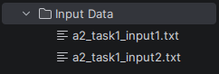
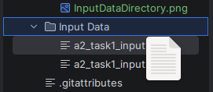
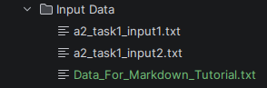
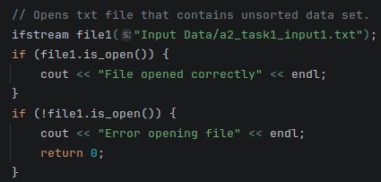
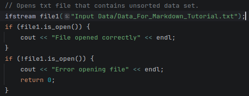
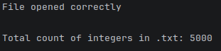
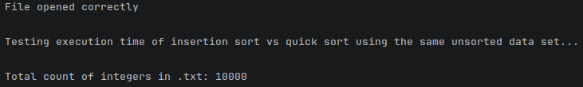

# CXX_InsertionSort_vs_QuickSort_Compare
### Comparison Between Insertion Sort & Quick Sort Execute Time in MS. Two comparisons are made between a unsorted data set and a nearly sorted data set that show that quicksort algorithm sorts 5000 unsorted integers faster than insertions sort. However, insertion sort is more efficient at sorting 5000 nearly sorted integers. 

# How To Run Program:

### Step 1: Open the Project Folder in your preferred IDE or Text Editor (with preferred compiler).

### Step 2: Ensure that the project folder contains these files;

    - InsertionSort.h
    - QuickSort.h
    - InsertionSort.cpp
    - QuickSprt.cpp
    - main.cpp
    - a2_task1_input1.txt
    - a2_task1_input2.txt

### Step 3: Run the application!

### Step 4: Allow the application to run until completed (no user input required).

### Step 5: Review the console for correctness of functionality & comparison of execution times.

# Using Different .txt Files:

### Step 1: Drag & Drop .txt file with new data to sort into Input Data Directory

### Step 2: Change ifstream file to new .txt in main.cpp

### Original ifstream file access (Count = 5000):

### Updated ifstream file access (Count = 10000):

### Step 3: Run Program with New File & Verify File Update

### Original .txt Count

### Updated .txt Count

# Final Notes:

### This project was completed closely following a project brief provided by Torrens University Australia. It is a sorting algorithm application used to compare the execution time of different sorting algorithms using unsorted and nearly sorted data sets. It is open for expansion by adding additional sorting algorithms i.e. bubble sort, merge sort, bucket sort etc. Can be utilised to better understand how sorting algorithms work inline with big o notation with complexity vs time. 

# Learning Resources:

### BitLemon. (2024, August 6). C++ Vectors Explained in 168 seconds. YouTube. https://www.youtube.com/watch?v=2XZrX_-yLrA

### CodeBeauty. (2022, July 13). STL vector (Relationship between Static array, Dynamic array and STL vector) with examples. YouTube. https://www.youtube.com/watch?v=VNb3VLIu1PA

### Codecademy. (2026). Learn C++: Vectors Cheatsheet | Codecademy. Codecademy. https://www.codecademy.com/learn/learn-c-plus-plus/modules/learn-cpp-vectors/cheatsheet

### GeeksforGeeks. (2013, March 7). Insertion Sort Algorithm. GeeksforGeeks. https://www.geeksforgeeks.org/dsa/insertion-sort-algorithm/

### GeeksforGeeks. (2014, January 7). Quick Sort. GeeksforGeeks. https://www.geeksforgeeks.org/dsa/quick-sort-algorithm/

### Shmeowlex. (2021, November 3). C++ Static 1D Array File Input. YouTube. https://www.youtube.com/watch?v=-CaRqdXJ_mU

### The Theory Of Code. (2017, September 9). C++ STL (Standard Template Library) Part-4 : STL Vector Erase Remove Idiom. YouTube. https://www.youtube.com/watch?v=pp5Hpo8duC8

### Rowell, E. (2019). Big-O Algorithm Complexity Cheat Sheet (Know Thy Complexities!). Bigocheatsheet.com. https://www.bigocheatsheet.com/
